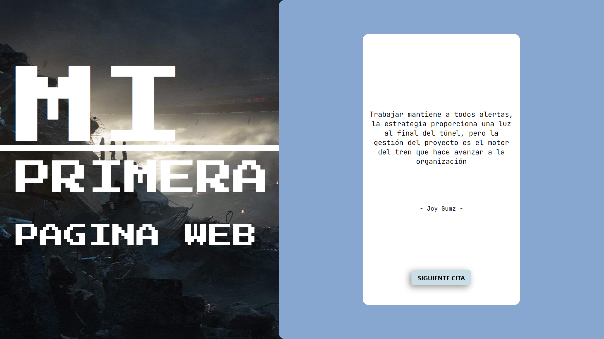

# MI PRIMERA PAGINA WEB RESPONSIVE

Este es mi primera página web responsive hecha con `HTML`, `CSS`, `JavaScript`. 
Donde precargue 10 citas en el archivo ***"quotes.js"*** y en ***"app.js"*** la logica para
obtener una cita aleatoria al precionar el boton *"nueva cita"* y mostrarla en la página 
con un color aleatorio de los 10 establecidos, como se puede observar en las siguientes
imagenes para **MOBILE** y **DESKTOP**.

## *WEB DESKTOP* 

## *WEB MOBILE*

